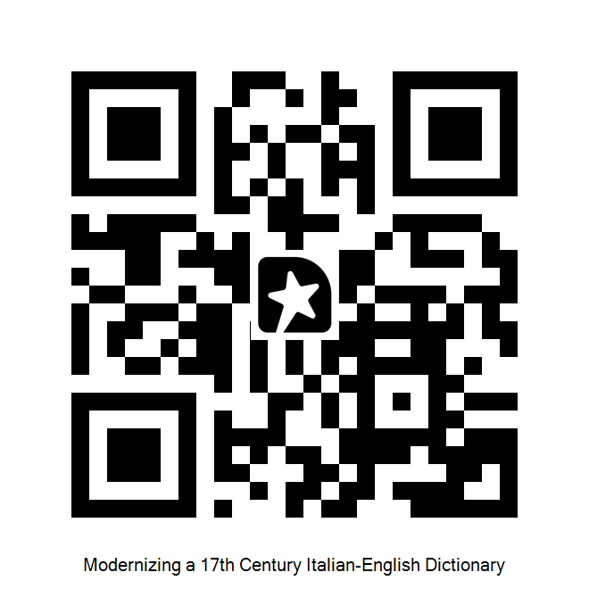

# Links for "Modernizing a 17th Century Italian-English Dictionary" .NET Conf 2025 Presentation

## Watch the session on YouTube

- ["Modernizing a 17th Century Italian-English Dictionary" on .NET Conf 2025 Playlist](https://www.youtube.com/watch?v=kNPTDlxEA-Y&list=PLdo4fOcmZ0oXtIlvq1tuORUtZqVG-HdCt&index=47&pp=iAQB0gcJCQMKAYcqIYzv)

## Site links

- Website: [https://florio.sebbs.au](https://florio.sebbs.au)
- GitHub: [https://github.com/Sebbs128/Florio](https://github.com/Sebbs128/Florio)

## "Queen Anna's New World of Words" - John Florio

- Scans: [https://www.pbm.com/~lindahl/florio/](https://www.pbm.com/~lindahl/florio/)
- Project Gutenberg Transcription: [https://www.gutenberg.org/ebooks/56200](https://www.gutenberg.org/ebooks/56200)

## ML.NET Docs @ Microsoft.Learn

- Use a pretrained model: [TextCatalog.ApplyWordEmbedding Method (Microsoft.ML) | Microsoft Learn](https://learn.microsoft.com/en-us/dotnet/api/microsoft.ml.textcatalog.applywordembedding#microsoft-ml-textcatalog-applywordembedding(microsoft-ml-transformscatalog-texttransforms-system-string-system-string-microsoft-ml-transforms-text-wordembeddingestimator-pretrainedmodelkind))
- FeaturizeText transform [Work with text data | Prepare data for building a model - ML.NET | Microsoft Learn](https://learn.microsoft.com/en-us/dotnet/machine-learning/how-to-guides/prepare-data-ml-net#work-with-text-data)
- ML.NET Transforms relevant to created a custom embedding model: [Data transformations - ML.NET | Microsoft Learn](https://learn.microsoft.com/en-us/dotnet/machine-learning/resources/transforms#conversions-between-data-types)
  - In particular, "Conversions between data types" and "Text transformations"
  - If you're working from images, consider "Image transformations" as well

## Where to find me

- GitHub: [https://github.com/Sebbs128](https://github.com/Sebbs128)
- Mastodon: [@sebbs@dotnet.social](https://dotnet.social/@sebbs)

## Session Feedback

I'd love to hear your feedback!

[Feedback on Sessionize](https://szfb.me/r54ggM)

